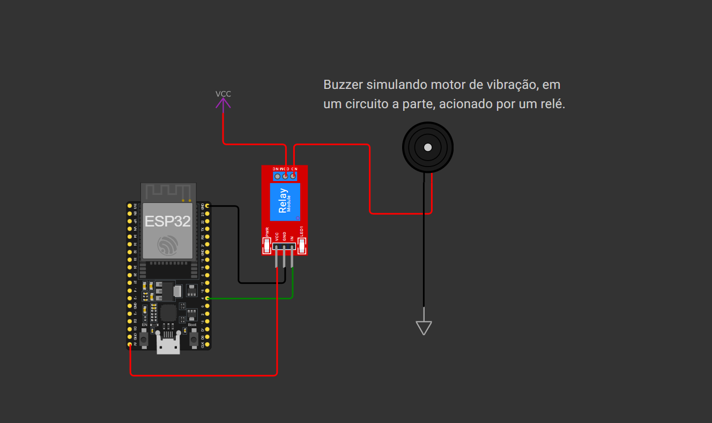

# Projeto "PosturAI" (Global Solution 2º semestre 2k25)

Este repositório contém o código-fonte desenvolvido para o projeto "PosturAI", parte da **Global Solution 2K25 Segundo Semestre da FIAP**. O projeto consiste em uma cadeira inteligente, conectada a uma IA de monitoramento de postura, desenvolvida em python. Quando a IA detecta uma má postura continua por mais de X tempo, envia o comando para que a cadeira vibre, indicando ao usuário que precisa ajeitar sua postura.

## Contexto

O projeto foi criado para demonstrar a conectividade entre os dispositivos IoT. Ele integra hardware e software, conectado a um broker MQTT, hospedado em uma máquina virtual local e aberta para a internet por meio de tuneis ngrok. Essa máquina virtual está rodando uma versão do ubuntu server, que por sua vez está executando diversos componentes baseados no repositório do Professor Fábio Cabrini (https://github.com/fabiocabrini/fiware).

---

## Participantes

* Prof. Paulo Marcotti (PF2150)
* Arthur Berlofa Bosi (RM564438)
* Arthur Ferreira Alves dos Santos RM564958
* Ulisses Ribeiro Abreu (RM562230)

---

## Tecnologias e Componentes

O projeto utiliza os seguintes componentes principais:

* **ESP32:** Microcontrolador principal, responsável por processar as requisições do servidor e gerenciar a conexão Wi-Fi.
* **Wi-Fi e HTTP:** Para a comunicação com o broker MQTT.
* **Ngrok:** Provedor de soluções de túnel para servidores e NAT's.
* **Agente Mosquitto:** Aplicação que será responsável por administrar as comunicações MQTT.
* **Ubuntu Server:** OS da máquina virtual.
* **VirtualBox:** Software de virtualização de hardware x86 e x64.

---

## Funcionalidades do Código

O código implementado realiza as seguintes tarefas:

1.  **Inicialização:**
    * Configura a comunicação serial, conexão WI-FI e a comunicação com o broker MQTT.
    * Exibe uma mensagem de inicialização no monitor serial.

2.  **Coleta de Dados:**
    * Lê as requisições do servidor e processa-as, decidindo se será ativada ou não a vibração da cadeira.

3.  **Envio de Dados para o broker:**
    * Utiliza a conectividade **Wi-Fi** do ESP32 para se conectar à internet.
    * Envia os dados de estado para o broker.

---

## Configuração e Uso

Para executar o projeto, siga os passos abaixo:

1.  **Instale as Bibliotecas:** Certifique-se de que as seguintes bibliotecas estejam instaladas na sua IDE do Arduino:
    * `WiFi.h`
    * `PubSubClient.h`

2.  **Hardware:** Monte o circuito conforme o esquema do projeto, conectando o ESP32 ao relé.
   

4.  **Credenciais:**
    * Altere as variáveis `default_SSID` e `default_PASSWORD` no código para as credenciais da sua rede Wi-Fi.
    * Altere também as variáveis `default_BROKER_MQTT` e `default_BROKER_PORT` para o IP e a porta do seu servidor com broker MQTT. Os padrões ja são da minha máquina virtual com um túnel ngrok.

5.  **Upload:** Faça o upload do código para o seu ESP32.

---

## Links Úteis

* **Acesso ao Código:** Acesse o arquivo do [código principal](./src/main.ino).
* **Biblioteca WiFi.h:** Acesse a documentação e exemplos da [biblioteca](https://docs.arduino.cc/libraries/wifi/).
* **Biblioteca PubSubClient.h:** Acesse a documentação e exemplos da [biblioteca](https://docs.arduino.cc/libraries/pubsubclient/).
* **Documentação ESP32:** Consulte a documentação oficial do [ESP32](https://docs.espressif.com/projects/esp-idf/en/latest/esp32/get-started/index.html) para aprender mais sobre suas funcionalidades.
